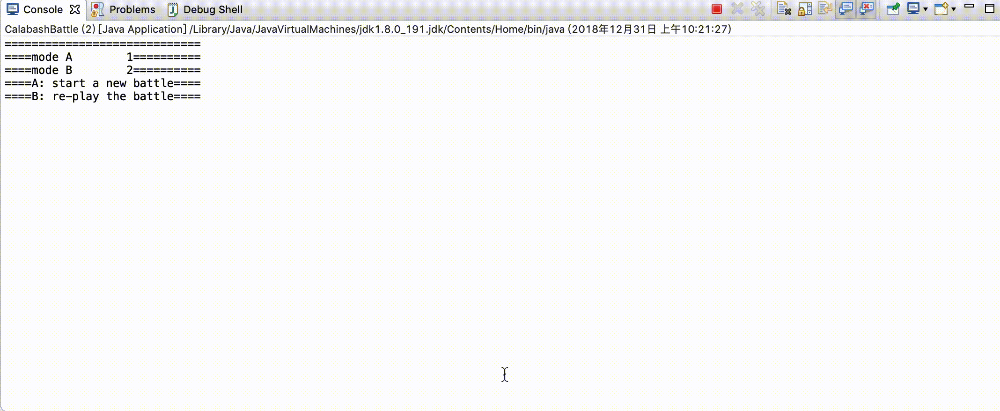

# README

Copyright @Huanyu Wang 2018.12.30


## 代码结构：

代码主要分布在两个模块中，一个是`application`，一个是`being`。`application`负责和界面相关的部分，`being`负责底层相关的部分。所涉及到的类如下：

#### application

+ Main.java

    继承自Application类，实现界面的登陆。

+ Controller.java

    负责GUI部分的实现，在这段代码中负责展示左边的战斗图像以及右边的文字显现模块。实现动态的刷新以及接受用户的输入。这一部分是终端运行的扩充，主要是负责将FightField对象中的个体信息转换到界面显示。

#### being

+ CalabashBattle.java

    这部分能够使用终端进行葫芦娃大战的模拟，用户能够选择战斗模式（新战斗或战斗回放），虽然没有界面却仍然能够展现出一个精彩的战斗场面。在类中登陆战士，构建起其链接关系，通过定时的刷新来展示当时场上的场景。模块化的设计，便于在GUI中继续使用。内含保存以及读取记录的操作。

+ FightField.java

    战场类，里面含有成员变量field，为二位的数组，数组元素为空时表示没有成员，否则指向在战场内的战士。真正的面向对象设计，战士在战场中，而不是通过id找到彼此。另外又一些与判断相关的方法。

+ Formation.java

    阵型信息，阵型内容保存在了文件中，所以第一步是读取文件的内容并将其进行解析，还原成阵型，实现的阵型有四种：长蛇阵、雁形阵、鹤翼阵、冲轭阵。输入所需要的阵型以及所在的位置（战场的左边或者右边）就能够得到阵型数组。

+ Team.java

    组织一个队伍的内容，方便的实现内容的打印以及敌我识别。主要的方法为：

    + goBattle() 根据阵型，将本队伍中的所有个体送上战场。

+ Warrior.java

    定义了战士类的代码，实现了WarriorInterface以及Runnable的接口，能够成为被观察者以及使用多线程进行编程。重要的方法为：

    + randomMove() 随机的进行移动，移动中需要判断位置是否合法以及是否有活的其他的生物体存在
    + run() 进程控制方法，循环的判断条件为本生物体活着以及对方仍然有活体存在，在每一个步骤中先进行随机的移动再进行攻击
    + attackOthers() 搜索前后方格中存在的活体，如果是敌方就对其进行攻击
    + posLog最终能够通过这个容器看到其移动情况

+ WarriorInterface.java

    定义了Warrior这个类所必须要满足的行为

p.s. 以上提到的类都有接口的设计，只是Warrior类更为重要所以其接口单独在一个文件中表示。

核心代码部分：

```java
// Warrior类中的run方法
public void run() {
		while(alive && !fightField.isDone()) {
		posLog.add(new int[] {position[0], position[1], life});
			int oldX = position[0];
			int oldY = position[1];
			randomMove();
			attackOthers();
			int newX = position[0];
			int newY = position[1];
			log.add( String.format("from [%d, %d] to [%d, %d]", oldX, oldY, newX, newY) );
		//fightField.showFields();
		// Log the information
		try {
		Thread.sleep(Information.DELAY);}
		catch(Exception e) {e.printStackTrace();}
		}
		posLog.add(new int[] {position[0], position[1], life});
		
		fightField.dead(id);
	}
```


# 代码设计：

## 概述：

本代码需要模拟的是葫芦娃大战妖精的画面，对于故事的设定，为了使其更具有观赏性，整个战斗人员分成两个队伍，在代码中分别为`goodMan`  `badMan`，每支队伍有8个人，与每个人相关的参数如下：

| 姓名   | 葫芦娃 | 老爷爷 | 蝎子精 | 小兵  | 蛇精 |
| ------ | ------ | ------ | ------ | ----- | ---- |
| id     | 1-7    | 8      | 9      | 10-15 | 16   |
| 攻击力 | 50     | 0      | 50     | 20    | 50   |
| 生命力 | 100    | 100    | 100    | 100   | 100  |

整个战斗场地为`15*15`的方格，首先双方选择阵型进入场地（总共有四种阵型可供选择）。规定每个个体能够在其周围`3*3`的网格内随机移动，并且能够对其周围`3*3`网格内的敌人进行攻击。当个体被攻击，会承受对方攻击力对生命值的冲击，当生命值低于0时，个体死亡，从界面中消失。战斗时会随时更新目前的战斗信息：个体的生命值以及击杀情况。


## 实现细节：

#### 面向对象的设计思想

每个战士为一个个体，有其特殊的属性，每个对象有``randomMove()`以及`attackOthers()`方法，真正的移动工作和攻击工作由个体来完成而不是外界帮助其完成。各类之间通过发送消息实现交流。

聚集：所有的生物体都是`Warrior`，一个队伍中的Warrior聚集成一个团队，在团队中能够做一些统一的工作，比如输出状态以及登陆武将。

使用了多种权限管理机制，在文件中有两个包，使得不同的包之间不会干扰。

#### 观察者模式

当每个个体独自行动的时候，出现的一个很重要的问题就是怎么把在行动过程中产生的信息通知给别人。这里使用的方法是观察者模式，每个个体中都有对`FightField`对象的引用，当在行动中改变位置以及击杀敌方的时候，能够通过这个对象确认下一步位置是否为空位，以及定位敌人。或者换一句话说，所有的个体都是`FightField`对象的观察对象。从而保证消息的同步。

```java
class Warrior{
   ...
   public FightField fightField;	// Observer
}
```

#### 面向接口编程

在程序编写中出现一个问题，为了完成观察者模式，需要在每个Warrior对象中包含对FightField的引用，但是FightField中的一个二维数组中需要记录每个Warrior对象的位置。问题在于，当完善FightField的定义时必须要知道Warrior的完整定义，而完成Warrior的定义的时候也需要有FightField的完整定义，构成矛盾编译不通过。解决方法就是使用面向接口的编程，FightField中国呢保存的是WarriorInterface这个接口，任何完善了这个接口的类都能放入其中，由此解决了矛盾的问题。

```java
class FightField{
...
    public WarriorInterface[][] field = new WarriorInterface[Information.SIZE][Information.SIZE];
}
```

#### 随处可见的战斗内容记录

为了能够更好地记录战斗的场面，在多个类中都包含有记录的部分，在Warrior类中能够记录每个个体的位置移动情况以及生命值情况；在FightField中能够记录击杀情况。

```java
public ArrayList<String> battleLog; // in class FightField

public ArrayList<String> log;
public ArrayList<int[]> posLog;		// in class Warrior
```

#### 多线程：

完成多线程的编写，每个个体都是一个线程，并且统一在线程池中被管理，当个体死亡的时候结束进程。在多线程运行中会出现共用资源的情况，所以需要对资源进行管理，避免冲突。

```java
// in CalabashBattle
for(int i=0; i<8; i++) {
	pool.execute(new Thread(goodMan.team.get(i)));
	pool.execute(new Thread(badMan.team.get(i)));
}
pool.shutdown();
```

#### 注解：

使用注解方法对程序进行标注。

#### 测试：

对底层的代码进行测试，确保其运行正常。

## 运行截图：

**终端模式下运行截图**



**终端模式下显示的每个Warrior的Log**


**终端模式下显示的整个战场Log**


**可视化的战斗显示**


**回放显示**


